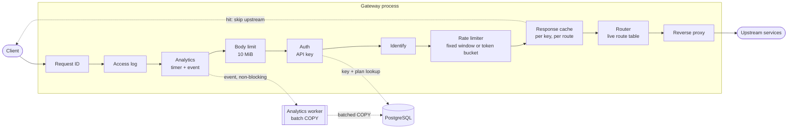
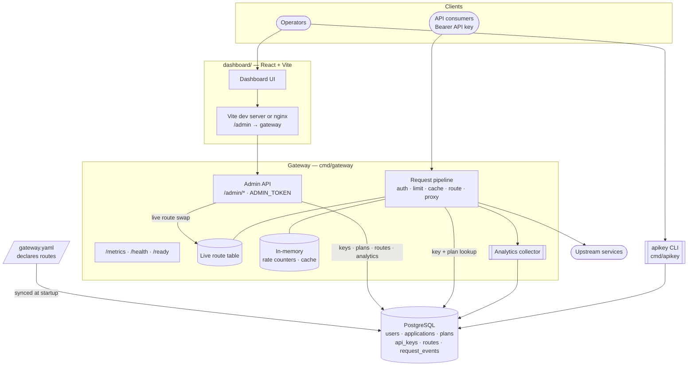

# Architecture

## Request path

Every proxied request passes through the same chain. `/health`, `/ready`, `/metrics`, and the admin API branch off before it.

| Stage | Package | Rejects with | State |
|---|---|---|---|
| Request ID | `internal/requestid` | — | — |
| Access log | `internal/proxy` | — | — |
| Analytics | `internal/metrics` | — | Buffered channel → worker → `request_events` |
| Body limit | `internal/proxy` | 413 over 10 MiB | — |
| Auth | `internal/auth` | 401 missing/invalid, 403 revoked, 503 DB down | `api_keys` + `plans` (one query per request) |
| Identify | `internal/metrics` | — | Attaches key/app/plan to the analytics event |
| Rate limiter | `internal/limiter` | 429 + `Retry-After` | In-memory: clock-aligned minute counters, or token buckets (ADR-007) |
| Cache | `internal/cache` | — | In-memory, 256 MiB cap, TTL per route |
| Router | `internal/routing` | 404 no route | Atomic route table (swapped by admin edits) |
| Proxy | `internal/proxy` | 502 upstream error or unsafe address, 504 timeout, 413 body too large | Pooled keep-alive connections per upstream |

## Whole system

## Where state lives

| Data | Stored in | Shared across instances | Survives restart |
|---|---|---|---|
| Users, applications, API key hashes | PostgreSQL | yes | yes |
| Plan limits | PostgreSQL (read on every request) | yes, immediately | yes |
| Routes (upstream, cache TTL) | PostgreSQL + in-memory live table | on restart (ADR-005) | yes |
| Rate-limit counters or token buckets | memory | no (per instance) | no |
| Cached responses | memory | no (per instance) | no |
| Analytics events | PostgreSQL (`request_events`) | yes | yes (unflushed events are lost on crash) |

## Design decisions

See [decisions.md](decisions.md):

| ADR | Decision |
|---|---|
| 001 | One upstream timeout for the whole request/response |
| 002 | In-memory fixed-window rate limiting; limits stored on plans |
| 003 | Opt-in per-route response cache, scoped per API key |
| 004 | Raw analytics events, async batched writes, aggregated at query time |
| 005 | Routes in PostgreSQL, declared by gateway.yaml, edited via admin API |
| 006 | Dashboard as a separate Vite app, same-origin via proxy |
| 007 | Token bucket as an optional rate-limiting algorithm |
| 008 | Body size limit, blocked link-local upstreams, readiness check |
| 009 | Upstream connection pool sized for concurrency |
| 010 | Docker Compose demo stack with published demo credentials |
